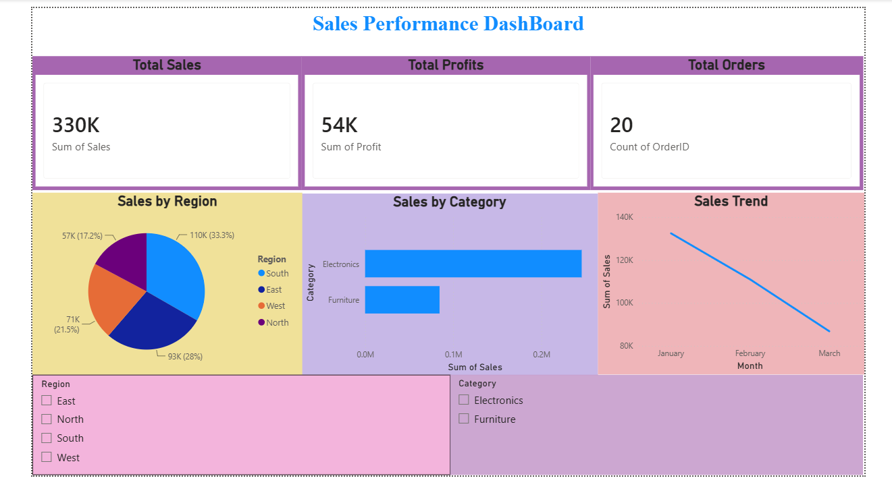

# Sales-Performance-Dashboard
Developed a Power BI Sales Performance Dashboard with KPI cards, bar charts, pie charts, line charts, and interactive slicers to analyze sales, profit, orders, category-wise performance, and regional trends.

## Features
- Total Sales KPI
- Total Profit KPI
- Total Orders KPI
- Sales by Region Analysis
- Sales by Category Analysis
- Monthly Sales Trend
- Interactive Slicers

## Tools Used
- Power BI Desktop
- Microsoft Excel

## Dashboard Preview

## Project Files
- Sales_Performance_Dashboard.pbix
- dashboard.png

## Author
Sai Manasa K
